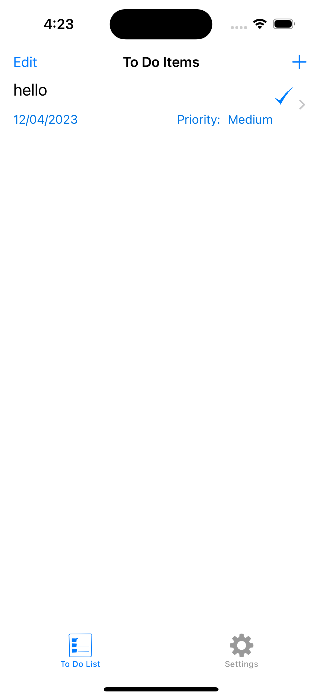
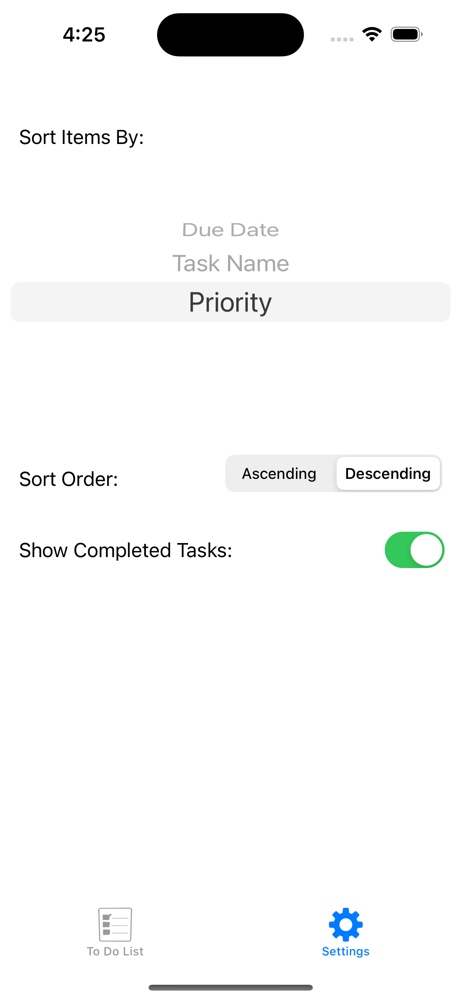
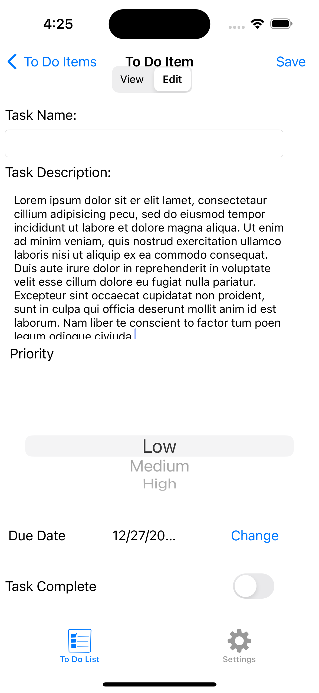

# Todo UIKit App

## Overview
This Todo app, built using UIKit, offers a simple and intuitive interface for managing daily tasks. It's designed for iOS users who need an efficient way to track and complete their to-do items.

## Features
- Add, edit, and delete tasks
- Mark tasks as complete/incomplete
- Categorize tasks
- Light and dark mode support

## Installation
1. Clone the repository: `git clone [repo-link]`
2. Open `TodoUIKitApp.xcodeproj` in Xcode
3. Run the app on your iOS device or simulator

## Usage
To add a new task, tap the '+' button. Swipe left on a task to edit or delete it. Tap a task to mark it as complete.

## Contributing
Contributions are welcome. Please fork the repository and submit a pull request.

## License
[MIT License](LICENSE)

## Contact
For any queries or suggestions, please reach out to [Your Email].

## Acknowledgments
- Icons and graphics from [source]
- UIKit community
